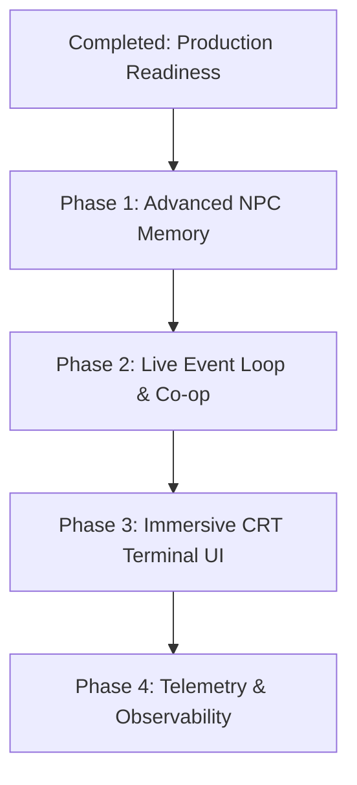

# Shangri-la: Age of Steam - Development Roadmap

This document outlines the architecture, the production-readiness improvements implemented, and the strategic roadmap for future feature development of **Shangri-la: Age of Steam**.

---

## 1. Project Overview & Architecture
**Shangri-la: Age of Steam** is a text-driven RPG powered by an LLM backend (designed for vLLM). 

- **Backend:** FastAPI handles API routing, state serialization, and narrative generation via a vLLM client.
- **Database:** SQLModel (SQLite) maintains persistent states for locations, NPC traits/dispositions/memories, and world events.
- **Frontend:** A Vite + React application styled with Tailwind CSS, offering a terminal-style narrative console.
- **Production Infrastructure:** Containerized with Docker and orchestrated using Docker Compose, optimized for deployments on TrueNAS SCALE or local environments.

---

## 2. Completed Production Readiness Fixes

A series of key architectural and configuration issues were identified and fixed to make the application fully runnable, testable, and deployable:

### A. Backend & Database Enhancements
- **Self-Healing Database Lifespan:** Added a FastAPI lifespan event handler to automatically initialize database tables and seed the database with initial world locations and NPCs on startup. This makes local development and deployment out-of-the-box self-healing without requiring manual database migration or seed commands.
- **FastAPI CORS Configuration:** Integrated `CORSMiddleware` in `backend/main.py` allowing cross-origin requests, resolving console blocked requests during direct local testing.
- **Python Imports in Docker:** Corrected the package path structure in the duplicate `backend/Dockerfile.backend` which previously copied files directly to `/app/` and threw a `ModuleNotFoundError` on absolute imports (`from backend.models import ...`). Aligned it with the correct root `Dockerfile.backend` setup.
- **Docker Command Overrides:** Updated `backend/entrypoint.sh` to use the standard `exec "$@"` pattern so that users can override container start commands (e.g. running pytest or opening a shell) while still preserving automated DB initialization.

### B. Frontend & API Communication
- **Relative Path Routing:** Swapped the hardcoded `http://localhost:8000` base URL in `frontend/src/api.ts` with a relative `/api` path. This decouples the frontend code from specific hosts or ports at build time.
- **Development Server Proxy:** Added a Vite development proxy in `frontend/vite.config.ts` mapping `/api` calls directly to `http://localhost:8000` to avoid CORS issues and simplify local developer setups.
- **Production Nginx Proxying:** Configured Nginx in `frontend/nginx.conf` to act as a reverse proxy forwarding `/api/*` requests to the backend service container, matching standard microservice architectures.

### C. Deployment & Orchestration
- **Flexible Data Directories:** Parameterized the host volume mounts in `docker-compose.yml` to use `SAOS_DATA_DIR` (defaulting to `./saos_data` relative path) rather than a hardcoded TrueNAS absolute path (`/mnt/tank/saos_data`), allowing the system to run locally immediately.
- **Local Container Build Support:** Embedded `build` context blocks in `docker-compose.yml` to enable compiling the frontend and backend directly from source during local runs (`docker compose up --build`).
- **Cleaned Configuration:** Mapped `VLLM_API_BASE` directly to the backend container (where the vLLM client lives) and purged the obsolete `VLLM_SERVER_URL` from the frontend environment config.
- **Cleaned Workspace:** Removed redundant nested repository clones to ensure a clean codebase for version control.

---

## 3. Strategic Development Roadmap

The future development is structured into four distinct phases focusing on rich narrative features, scalability, and UX/UI polished interfaces.

### Phase 1: Advanced NPC Memory & Vector Embeddings
- **Semantic Memory Retrieval:** Transition NPC memories from simple JSON lists to a local vector store (e.g. SQLite-VSS) to support semantic query-based recall rather than dumping all history into the prompt context.
- **Emotional & Disposition Decay:** Implement a time/interaction-based decay system for NPC dispositions, making them adapt to player behavior over long narrative arcs.
- **Memory Consolidation:** Establish a background worker that runs periodic summarization tasks on NPC memories, synthesizing old conversations into long-term summary traits to prevent prompt token bloat.

### Phase 2: Live Event Loop & WebSocket Co-op
- **WebSocket Streaming:** Migrate the current polling/blocking POST chat model to WebSockets, enabling real-time streaming of narrative generation output letter-by-letter.
- **Background Event Loop:** Introduce background events (e.g., steam pressure fluctuations, patrol movements) that occur independently of player inputs.
- **Multiplayer Co-op:** Support multiple players joining the same world state session with separate terminal consoles, sharing narrative context and world updates.

### Phase 3: Immersive CRT Terminal UI
- **Visual Theme & Audio:** Implement a retro-futuristic CRT styling with scanline overlay filters, flicker effects, and typing audio sound effects.
- **Interactive Sidebar Panels:** Introduce panels showing the active player state, location maps, known NPC relationship sheets, and inventory logs.
- **Command Line Input Auto-complete:** Support CLI command style inputs with autocomplete suggestions (e.g., `/go`, `/talk`, `/inspect`).

### Phase 4: Production Telemetry & Observability
- **Prometheus Metrics:** Add instrumentation for prompt token throughput, vLLM response latency, and database transaction times.
- **Log Aggregation:** Standardize FastAPI structured JSON logs for simple integration with Grafana Loki or ELK stacks.
- **CI/CD Integration:** Set up GitHub workflows executing automated unit tests, backend linting, and building production Docker images on main branch merges.
